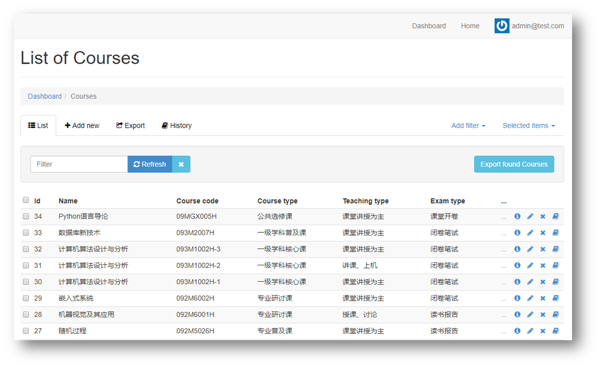
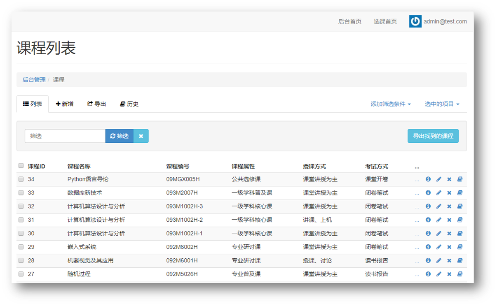

# Courses Selecting System Based On Ruby On Rails(基于Ruby On Rails的选课系统)[](https://travis-ci.org/jocelynxyq/CourseSelect)

## 介绍

本系统是基于Ruby On Rails开发的选课系统，可以实现多角色登陆系统完成选课等功能。具有良好的扩展性，可利用其基础开发更多功能的选课系统。  
项目已部署在heroku平台上 [Heroku演示地址](https://ucascourse.herokuapp.com/)  

## 安装环境

### 云IDE（推荐）

除了一般的本地搭建环境，还可以选择例如Cloud9类似的云IDE，使用这些云IDE可以免除在本地搭建环境的烦恼，只要能上网电脑，都能通过网页访问云IDE，在线编辑代码并运行。  
例如使用Cloud9。

### 本地

安装Bundler，Gem，Ruby，Rails依赖环境。

安装postgresql数据库，并运行psql -h localhost检查安装情况。

## 运行实例（以Cloud9为例）

1.fork本仓库。

2.注册Cloud9环境然后登陆，点击创建新的工作空间，在Clone from Git的网址那里的url填写fork后的分支url，例如https://github.com/你的github账号名字/CourseSelect。填好项目名字，然后将项目语言选为Ruby就可以点击创建了。

3.进入IDE编辑页面。

4.在终端中输入`bundle install`，安装项目需要的外部库（Rails中把这些库称为Gems），等待所有依赖的库都安装完毕。

5.本来Rails默认支持的是内置的Sqlite3数据库，无需安装，但是这个项目为了后期与Heroku更好接轨，使用的是postgresql这个数据库。幸运的是，Cloud9为我们预装好了Postgresql数据库，我们只需要在终端中输入sudo service postgresql start，就能启动postgresql数据库。

此时我们如果直接建表的话，会报关于编码的错误：`PG::Error: ERROR: new encoding (UTF8) is incompatible`，根据这里，我们在终端中逐行运行下面代码来解决上面的问题：

```
$ psql
psql (9.3.14)
Type "help" for help.

ubuntu=# UPDATE pg_database SET datistemplate = FALSE WHERE datname = 'template1';
UPDATE 1
ubuntu=# DROP DATABASE template1;
DROP DATABASE
ubuntu=# CREATE DATABASE template1 WITH TEMPLATE = template0 ENCODING = 'UNICODE';
CREATE DATABASE
ubuntu=# UPDATE pg_database SET datistemplate = TRUE WHERE datname = 'template1';
UPDATE 1
ubuntu=# \c template1
You are now connected to database "template1" as user "ubuntu".
template1=# VACUUM FREEZE;
VACUUM
template1-# \q
```

6.准备好数据库后，建立表：`$ rake db:create:all`

然后运行数据迁移：`$ rake db:migrate`

最后写入种子数据：`$ rake db:seed`

7.点击IDE上面的Run Project按钮，在log里会显示网站的地址，点击网址就能进入项目的演示页面。此时实例就运行好了。

在本地运行实例，也是相似的步骤，按序运行下面的命令
```
$ git clone https://github.com/PENGZhaoqing/CourseSelect
$ cd CourseSelect
$ bundle install
$ rake db:migrate
$ rake db:seed
$ rails s 
```

然后在浏览器中输入`localhost:3000`访问主页即可。

## 项目功能：

* 多角色登陆（学生，老师，管理员）
* 权限控制：老师和学生只能看到自己相关课程信息
* 控制选课人数
* 处理选课冲突（名称冲突、时间冲突）

### 学生角色

* 动态选课，退课
* 统计已选课程学分
* 生成个人课表
* 课程筛选
* 统计个人绩点
* 查看课程大纲
* 批量选课

### 教师角色

* 动态增加、删除课程
* 显示已选人数
* 已选学生统计图
* 对课程下的学生添加、修改成绩
* EXCEL导入导出学生成绩单
* EXCEL导出学生名单
* 生成教师课表

### 管理员角色

* 发出教务通知 

## 操作指南

选课系统主页显示教务通知和相关链接模块，进入选课系统首先要进行登陆。  

### 登陆该系统

1.学生登陆：

账号：`student1@test.com`

密码：`password`

2.教师登陆：

账号：`teacher1@test.com`

密码：`password`

3.管理员登陆：

账号：`admin@test.com`

密码：`password`

账号中数字都可以替换成2,3...等等

### 学生角色

学生登陆后可进入选课系统进行选课、退课等操作，选课系统提供课程筛选以及课表显示，冲突提醒等众多功能。

在选修课程界面，用户可以看到当前开课的课程列表，包括课程限选人数和已选人数，并通过最上方的课程筛选根据课程属性、考试方式、上课时间对当前的课程进行细化筛选，快速找到想选择的课程。 

   

课程大纲可以帮助学生了解本课程更多详细信息。  

  

课程可以通过多选加入学生的已选课程列表，课程之间不能有时间冲突和重名冲突，否则会有相关提示并且选课失败。  

  

在已选课程界面，用户可以查看当前已成功选择的课程和已选学分，并且可以对所选课程进行删除操作。

  

在个人课表界面，用户可以查看根据当前所选课程生成的课程表，鼠标悬浮可以查看课程的上课周数等详细信息。

  

在查询成绩界面，用户可以查看当前已出成绩的课程及分数，并可以看到已获学分和平均学分成绩的统计结果。

  

### 教师角色

教师登陆后可以对相关课程进行编辑，查看选课情况，对课程进行删除以及关闭、给学生打分等功能。

在已授课程界面，用户可以看到当前授课的课程列表和已选人数，并可以对课程进行编辑和开放/关闭/删除操作。 

  

点击已选人数，可以看到当前选课学生的具体信息。

  
 
在当前界面可以进行导出学生名单的操作。点击图表展示，可以看到包括学生来自院所的统计图表。

  
 
在创建新课程界面，用户可以输入相应内容来创建一门新的课程。

  
 
在教师课表界面，用户可以看到当前授课的时间表。

  
 
在成绩管理界面，用户可以对当前授课的课程下的学生打分，可以通过导出成绩单，在导出的空成绩单内填入学生成绩，再将该成绩单进行导入来实现批量输入成绩的操作。

  
 
## 关于汉化后台语言

本项目使用[`Rails_admin Gem`](https://rubygems.org/gems/rails_admin)作为后台管理,但是原生的后台语言是英文的界面，如下：
 
  
 
在本项目中，为了优化用户体验，进行了后台语言的汉化工作，如下图所示：

  
 
过程如下：

在项目树下config/locales文件夹中，新建zh-CN.yml文件，在其中放入一一对应的中文汉化语言。以下提到的均放入这个文件中。

对于所有项目通用的内容，如：

```
misc:
      search: "搜索"
      filter: "筛选"
      refresh: "筛选"
      show_all: "显示全部"
      add_filter: "添加筛选条件"
      bulk_menu_title: "选中的项目"
```

先英文，然后对应中文。对于大部分的对应解释可以在网上搜索找到，直接复制即可。要注意缩进关系。

对于数据库模型，要进行手动添加，本项目所添加的数据库模型汉化部分如下：

```
activerecord:
    models:
      course: "课程"
      grade: "成绩"
      notice: "通知"
      user: "用户"
    attributes:
      course:
        id: "课程ID"
        name: "课程名称"
        course_code: "课程编号"
        course_type: "课程属性"
        teaching_type: "授课方式"
        exam_type: "考试方式"
        credit: "课时/学分"
        limit_num: "限选人数"
        student_num: "已选人数"
        class_room: "上课地点"
        course_time: "上课时间"
        course_week: "上课周数"
        teacher: "授课教师"
        created_at: "创建时间"
        updated_at: "更新时间"
        open: "是否开放"
        outline: "课程大纲"
        grades: "成绩记录"
        users: "学生姓名"
      grade:
        id: "成绩ID"
        course: "课程名称"
        user: "学生姓名"
        grade: "成绩"
        created_at: "创建时间"
        updated_at: "更新时间"
      user:
        id: "用户编号"
        name: "姓名"
        email: "邮箱"
        num: "学号"
        major: "专业"
        department: "单位"
        password_digest: "密码摘要"
        admin: "管理员角色"
        teacher: "教师角色"
        created_at: "创建时间"
        updated_at: "更新时间"
        grades: "成绩记录"
        courses: "选课记录"
        teaching_courses: "授课记录"
      notice:
        id: "通知编号"
        user: "用户"
        title: "标题"
        content: "内容"
        created_at: "创建时间"
        updated_at: "更新时间"
```

添加完成后，重新启动项目，即可。

## 项目部署

项目可直接在Heroku上进行部署

1.创建Heroku账号以及Heroku app

2.将Heroku app与Github下的项目进行连接

3.下载配置[Heroku CLI](https://devcenter.heroku.com/articles/heroku-command-line)命令行工具

4.运行`heroku login`在终端登陆。

5.登陆成功后，使用`heroku git:remote -a app_name`切换到即将要部署的heroku app里。

6.运行部署，使用命令`git push heroku master`将当前目录下的项目push到heroku服务器中，提交前请将所有的修改都提交。

7.在服务器中建表，运行`heroku run rake db:migrate`，然后也可以写入种子数据`heroku run rake db:seed`， 若要重构整个数据库，使用`heroku pg:reset`来重构。

8.数据库建好之后，就可以进行正常访问了，使用`heroku ps`查看运行情况，使用`heroku open`访问网页。

## 本地测试

本项目包含了部分的测试（integration/fixture/model test），测试文件位于/test目录下。一键运行所有测试使用`rake test`：

```
$ rake test
Run options: --seed 15794

# Running:
.........

Finished in 1.202169s, 7.4865 runs/s, 16.6366 assertions/s.

9 runs, 20 assertions, 0 failures, 0 errors, 0 skips
```

### 模型测试

以用户模型为例, 位于`test/models/user_test.rb`, 首先生成一个`@user`对象，然后`assert`用户是否有效，这里的调用`valid`方法会去检查你的模型中的相关的`validates`语句是否正确，若`@user.valid?`为false, 那么此`assert`会报错，代表`"should be valid"`这条测试没有通过, 单独运行此测试文件使用`rake test test/models/user_test.rb`


```
class UserTest < ActiveSupport::TestCase
  # test "the truth" do
  #   assert true
  # end

  def setup
    @user = User.new(name: "Example User", email: "user@example.com", password: "password", password_confirmation: "password")
  end

  test "should be valid" do
    assert  @user.valid?
  end

  ...

end
```

### 视图和控制器测试

以用户登录为例，位于`test/integration/user_login_test.rb`，首先同样生成一个@user模型，这个@user的用户名和密码可以在`test/fixtures/users.yml`中指定, 然后我们用get方法到达登录页面（sessions_login_path），然后使用post方法提交这个@user的账号密码来登录，如果登录成功，当前应该会跳转至homes控制器下的index方法进行处理，`assert_redirected_to`能判断这个跳转过程是否发生，然后调用`follow_redirect！`来紧跟当前的跳转，用`assert_template`来判读跳转后的视图文件是否为`homes/index`, 最后在这个视图文件下做一些测试，比如判断这个视图下连接为root_path的个数等等（根据当前登录的角色不同，当前的页面链接会不同，比如admin用户就会有控制面板的链接rails_admin_path，而普通用户没有，因此可以根据链接的个数来判断当前登录用户的角色）

```
class UserLoginTest < ActionDispatch::IntegrationTest

  def setup
    @user = users(:peng)
  end

  test "login with valid information" do
    get sessions_login_path
    post sessions_login_path(params: {session: {email: @user.email, password: 'password'}})
    assert_redirected_to controller: :homes, action: :index
    follow_redirect!
    assert_template 'homes/index'
    assert_select "a[href=?]", root_path, count: 2
    assert_select "a[href=?]", rails_admin_path, count: 0
  end
end
```

## Travis CI 线上自动测试

上述为本地测试，我们可以使用Travis CI来实现自动测试，首先申请一个Travis CI的账号，然后与自己的github连接起来。  

然后在自己项目根目录中增加一个新的文件`.travis.yml`如下，这个文件中指定了测试需要的ruby版本，数据库等配置以及一些测试前的脚本操作。  

```
language: ruby

rvm:
  - 2.2

env:
  - DB=pgsql

services:
  - postgresql

script:
  - RAILS_ENV=test bundle exec rake db:migrate --trace
  - bundle exec rake db:test:prepare
  - bundle exec rake

before_script:
  - cp config/database.yml.travis config/database.yml
  - psql -c 'create database courseselect_test;' -U postgres
```

当github发生更新后，Travis CI会自动触发测试（需要你在Travis CI中自己设置自动/手动触发），然后读取你的`.travis.yml`文件配置进行测试。  

其实就是把本地测试拉到服务器上进行，测试成功后会在你的github项目给一个buliding pass的标签，代表当前的代码是通过测试的
