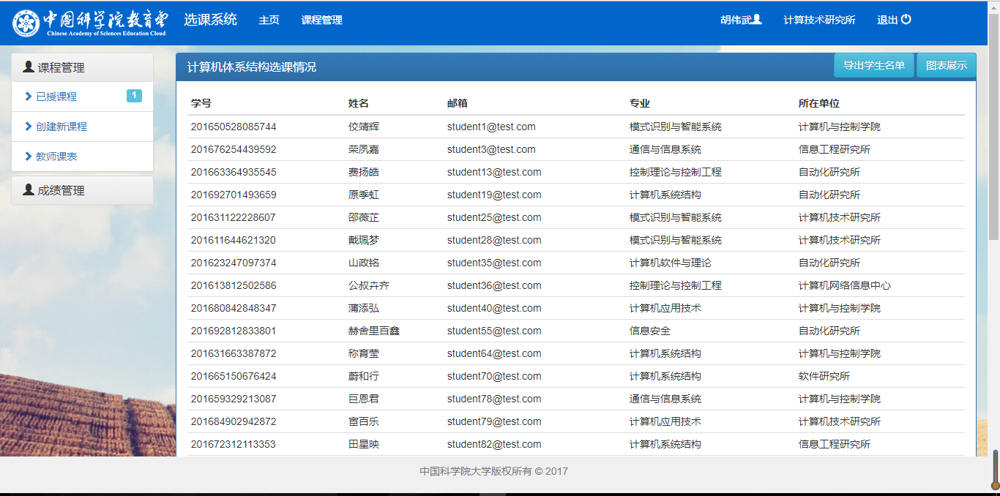

# Advanced CourseSelect(升级版选课系统)[](https://travis-ci.org/jocelynxyq/CourseSelect)

本系统是基于国科大高级软件工程课程项目[CourseSelect](https://github.com/PENGZhaoqing/CourseSelect)而开发的升级版，主要进行了一些功能的增加完善和界面上的优化。  

本项目已部署在heroku平台上 [Heroku演示地址](https://ucascourse.herokuapp.com/)  

## 原系统功能：

* 多角色登陆（学生，老师，管理员）
* 学生动态选课，退课
* 老师动态增加，删除课程
* 老师对课程下的学生添加、修改成绩
* 权限控制：老师和学生只能看到自己相关课程信息

## 升级版系统增加/修改的功能:

### 学生角色

* 统计已选课程学分
* 生成个人课表
* 课程筛选
* 统计个人绩点
* 查看课程大纲
* 批量选课

### 教师角色

* 课程列表中显示已选人数
* 已选学生统计图
* EXCEL导入导出学生成绩单
* EXCEL导出学生名单
* 生成教师课表

### 管理员角色

* 发出通知 
* 汉化管理员后台语言

### 整体功能

* 控制选课人数
* 处理选课冲突（名称冲突、时间冲突）

### UI部分

* 增强主界面、导航栏和footer显示
* 增加通知的显示

## 操作指南

选课系统主页显示教务通知和相关链接模块，进入选课系统首先要进行登陆。  

### 登陆该系统

1.学生登陆：

账号：`student1@test.com`

密码：`password`

2.教师登陆：

账号：`teacher1@test.com`

密码：`password`

3.管理员登陆：

账号：`admin@test.com`

密码：`password`

账号中数字都可以替换成2,3...等等

### 学生角色

学生登陆后可进入选课系统进行选课、退课等操作，选课系统提供课程筛选以及课表显示，冲突提醒等众多功能。

在选修课程界面，用户可以看到当前开课的课程列表，包括课程限选人数和已选人数，并通过最上方的课程筛选根据课程属性、考试方式、上课时间对当前的课程进行细化筛选，快速找到想选择的课程。 

   

课程大纲可以帮助学生了解本课程更多详细信息。  

  

课程可以通过多选加入学生的已选课程列表，课程之间不能有时间冲突和重名冲突，否则会有相关提示并且选课失败。  

  

在已选课程界面，用户可以查看当前已成功选择的课程和已选学分，并且可以对所选课程进行删除操作。

  

在个人课表界面，用户可以查看根据当前所选课程生成的课程表，鼠标悬浮可以查看课程的上课周数等详细信息。

  

在查询成绩界面，用户可以查看当前已出成绩的课程及分数，并可以看到已获学分和平均学分成绩的统计结果。

  

### 教师角色

教师登陆后可以对相关课程进行编辑，查看选课情况，对课程进行删除以及关闭、给学生打分等功能。

在已授课程界面，用户可以看到当前授课的课程列表和已选人数，并可以对课程进行编辑和开放/关闭/删除操作。 

  

点击已选人数，可以看到当前选课学生的具体信息。

  
 
在当前界面可以进行导出学生名单的操作。点击图表展示，可以看到包括学生来自院所的统计图表。

  
 
在创建新课程界面，用户可以输入相应内容来创建一门新的课程。

  
 
在教师课表界面，用户可以看到当前授课的时间表。

  
 
在成绩管理界面，用户可以对当前授课的课程下的学生打分，可以通过导出成绩单，在导出的空成绩单内填入学生成绩，再将该成绩单进行导入来实现批量输入成绩的操作。

  
 
## 说明

### 开发环境

本项目使用Cloud 9集成云开发环境，可以很方便搭建起开发所需的Ruby On Rails环境，省去很多麻烦。也可以在本地进行相应部署安装。  

[关于开发环境配置戳这里](http://blog.csdn.net/ppp8300885/article/details/52594839)

使用的库和数据库：

* 使用[Bootstrap](http://getbootstrap.com/)作为前端库
* 使用[Rails_admin Gem](https://github.com/sferik/rails_admin)作为后台管理
* 使用[Postgresql](http://postgresapp.com/)作为数据库
* 使用[Echarts](http://echarts.baidu.com/)作为可视化图表库

使用前需要安装Bundler，Gem，Ruby，Rails等依赖环境。

请根据本地系统下载安装[postgresql](https://devcenter.heroku.com/articles/heroku-postgresql#local-setup)数据库，并运行`psql -h localhost`检查安装情况。

### 本地安装

在终端（MacOS或Linux）中执行以下代码

```
$ git clone https://github.com/PENGZhaoqing/CourseSelect
$ cd CourseSelect
$ bundle install
$ rake db:migrate
$ rake db:seed
$ rails s 
```

在浏览器中输入`localhost:3000`访问主页

### 项目部署

项目可直接在Heroku上进行部署

1.创建Heroku账号以及Heroku app

2.将Heroku app与Github下的项目进行连接

3.下载配置[Heroku CLI](https://devcenter.heroku.com/articles/heroku-command-line)命令行工具

4.运行`heroku login`在终端登陆。

5.登陆成功后，使用`heroku git:remote -a app_name`切换到即将要部署的heroku app里。

6.运行部署，使用命令`git push heroku master`将当前目录下的项目push到heroku服务器中，提交前请将所有的修改都提交。

7.在服务器中建表，运行`heroku run rake db:migrate`，然后也可以写入种子数据`heroku run rake db:seed`， 若要重构整个数据库，使用`heroku pg:reset`来重构。

8.数据库建好之后，就可以进行正常访问了，使用`heroku ps`查看运行情况，使用`heroku open`访问网页。
